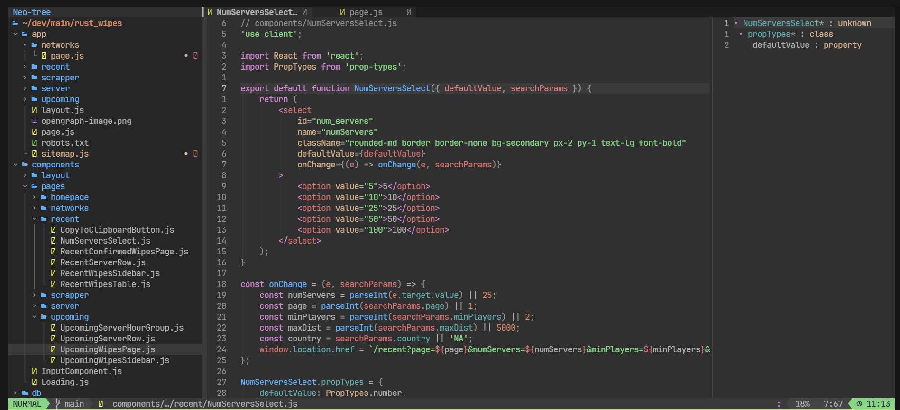

# LazyVim Ubuntu Installer


A comprehensive setup script (`ubuntu_setup.sh`) to automate the installation and configuration of a GUI environment from a headless Ubuntu 22.04 image, along with the installation of LazyVim (Neovim config) and various development tools.

## Features

-   Installs and configures a desktop GUI (GNOME) on a headless Ubuntu 22.04 image
-   Sets up VNC server (x11vnc) for remote access to the GUI environment
-   Installs and configures Alacritty terminal emulator with Fira Code Nerd Font
-   Installs Node.js, Yarn, and Bun for modern JavaScript development
-   Installs and configures Visual Studio Code with essential extensions
-   Installs and sets up LazyVim (Neovim config) with LSPs, plugins, and custom keybinds
-   Configures devicons for enhanced visual file type recognition in Neovim
-   Configures gnome-desktop to be able to render in 2560x1440

## Prerequisites

Before running the setup script, ensure that your system meets the following requirements:

-   Ubuntu 22.04 (headless or server image)
-   Internet connection

## Usage

1. Run the following command to execute the system setup script:

```
curl -fsSL https://raw.githubusercontent.com/tsmith165/lazyvim-ubuntu-installer/main/ubuntu_setup.sh | bash
```

2. Set the VNC password:

```
x11vnc -storepasswd
```

3. Start the VNC server:

```
~/.vnc/xstartup &
```

4. Open a VNC session using the IP address and port provided by the script, and enter the user-defined password.

5. Once connected to the VNC session, everything should be set up and ready to use

6. To open the Alacritty terminal use one of the following options:

    - During setup we created a desktop icon, if you see it on the gnome-desktop, double click it.
    - Alternatively you can run `ctrl + alt + t` to open the default ubuntu terminal. In the terminal run `alacritty`.

7. To open LazyVim run:

```
nvim
```



## Customization

If you want to customize the LazyVim configuration, you can modify the files in the `~/.config/nvim` directory.

For information on the custom keybinds and plugins, refer to the following files:

-   [Plugin and Custom Keybinds](VIM_PLUGIN_KEYBINDS.md)
-   [Generic Vim/Tmux/Linux Keybinds](VIM_MOTION_KEYBINDS.md)

## Troubleshooting

If you encounter any issues during the setup process, please check the log files generated by the setup script for detailed information and error messages.

## License

This project is licensed under the [MIT License](LICENSE).
